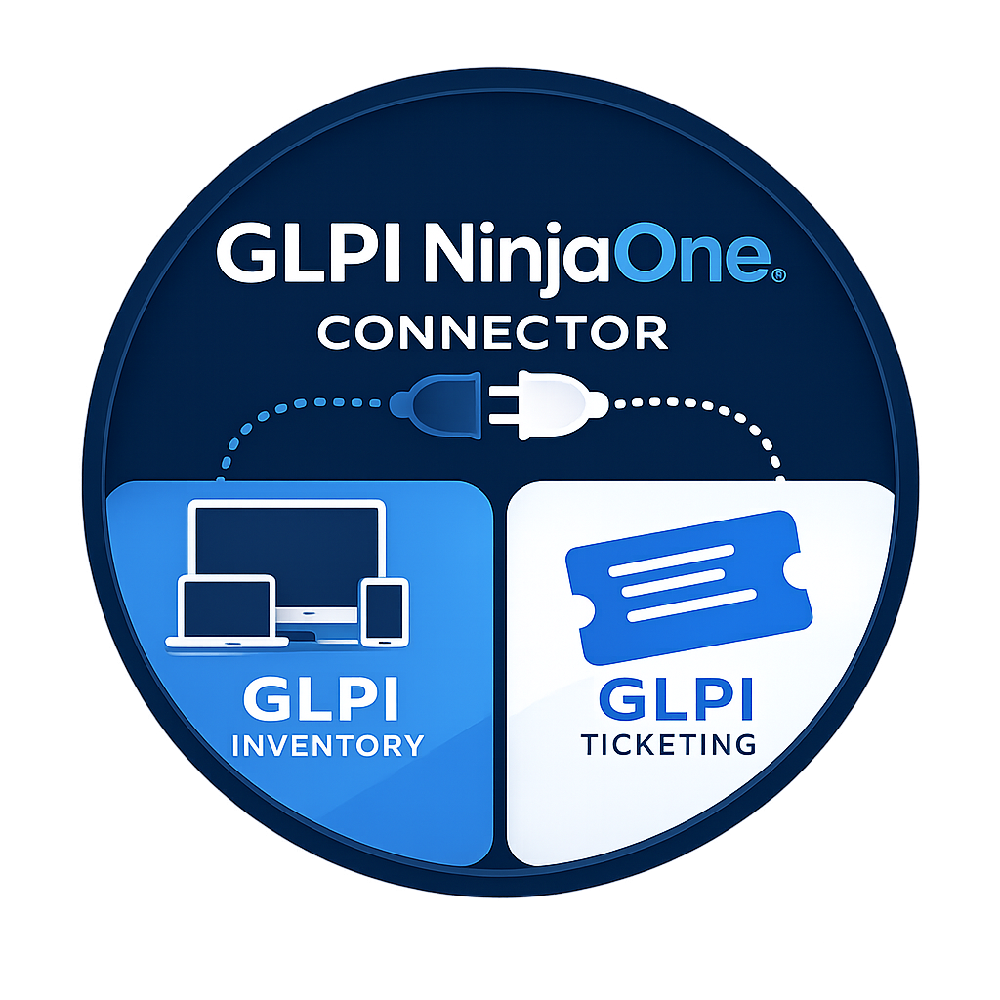

<p align="center">
  
</p>
<div align="center">


<br><br>


</div>

# GLPI NinjaOne Connector

GLPI NinjaOne Connector is a GLPI 11 plugin that links NinjaOne devices to native GLPI assets. It discovers NinjaOne organizations and locations, lets administrators map them explicitly to GLPI entities and locations, and synchronizes computers without turning NinjaOne into the GLPI source of truth.


## Purpose

The connector is designed around a clear split of responsibilities:

- GLPI remains the ITSM and asset management repository.
- NinjaOne remains the RMM platform and endpoint orchestration source.
- The plugin owns the durable relationship between NinjaOne device IDs and GLPI computers.
- Synchronization is explicit: organizations and locations must be reviewed and enabled before assets are imported.

## Features

- NinjaOne API connection using a Services API / Client Credentials application.
- Monitoring-only NinjaOne OAuth scope in the current release. Management and Control are displayed as future features but cannot be enabled yet.
- Dashboard cards for declared connections, active connections, active organizations, mapped locations, linked computers and pending links.
- NinjaOne organization discovery.
- Single-organization and multi-organization modes.
- Explicit organization-to-GLPI-entity mapping.
- Explicit NinjaOne location-to-GLPI-location mapping.
- Native GLPI computer creation and update.
- Two inventory modes:
  - Minimal synchronization: GLPI computers are updated from the data available through NinjaOne APIs and reports.
  - Advanced synchronization: NinjaOne is used as the link and orchestration source, while GLPI Agent portable performs the full hardware, OS and software inventory.
- NinjaOne tab and summary block on linked GLPI computers.
- Direct button to open the device in NinjaOne.
- Manual synchronization buttons.
- GLPI automatic actions for scheduled synchronization and log purge.
- PowerShell script generator for NinjaOne Automation when using GLPI Agent portable inventory.
- Link to GLPI asset import rules from the inventory source section.

## Requirements

- GLPI 11.x.
- PHP 8.2 or newer.
- PHP extensions: `curl`, `json`, `openssl`.
- Outbound HTTPS access from the GLPI server to the NinjaOne instance.
- A NinjaOne Services API application using Client Credentials.
- GLPI administrator rights to install and configure the plugin.

## Installation

Copy or extract the plugin into the GLPI `marketplace` directory:

```text
GLPI/
  marketplace/
    ninjaone/
      setup.php
      hook.php
      src/
      front/
      locales/
```

Then:

1. Open `Setup > Plugins` in GLPI.
2. Install and enable **NinjaOne connector**.
3. Open the plugin configuration page.
4. Add a NinjaOne connection.

The plugin also works when exposed from `/plugins/ninjaone/`; the bootstrap file detects common GLPI plugin paths.

## NinjaOne API Setup

Create a dedicated NinjaOne API application for the connector.

Recommended settings:

- Application type: `Services API` / `API Services`.
- Authentication mode: `Client Credentials`.
- Scope: `Monitoring`.
- Keep the generated `Client ID` and `Client secret`.
- Use the base URL for your NinjaOne region, for example:

```text
https://eu.ninjarmm.com
```

If NinjaOne requires an OAuth redirect URI, use one of the following depending on your GLPI deployment:

```text
https://your-glpi.example/marketplace/ninjaone/front/oauth.callback.php
https://your-glpi.example/plugins/ninjaone/front/oauth.callback.php
```


## GLPI Connection

In GLPI, open the plugin page and choose **Add a NinjaOne connection**.

Fill in:

- connection name;
- NinjaOne base URL;
- Client ID;
- Client secret;
- redirect URL if required;
- active/inactive state.

The current release sends only the `monitoring` scope. `Management` and `Control` are intentionally disabled in the interface and reserved for future features.


After saving the connection, use the configuration page to:

- test the API connection;
- run a manual synchronization;
- configure organization mode;
- configure inventory source;
- inspect logs and payloads.

## Organization Mapping

The plugin never imports every NinjaOne organization automatically.

Recommended sequence:

1. Create and save the NinjaOne connection.
2. Run a first synchronization to discover organizations and locations.
3. Choose single-organization or multi-organization mode.
4. Map NinjaOne organizations to GLPI entities.
5. Enable only the organizations that should synchronize.

Newly discovered organizations are disabled by default. An administrator must explicitly map and enable them.

### Single-Organization Mode

One NinjaOne organization is selected directly from the connection configuration and mapped to one GLPI entity.


### Multi-Organization Mode

Several NinjaOne organizations can be mapped separately. The dedicated mapping page lets an administrator bulk-enable, disable, and assign GLPI entities.


## Location Mapping

NinjaOne locations can be mapped to GLPI locations.

When an organization is mapped to a GLPI entity, the location mapping page can also create a new GLPI location from the NinjaOne location name. Selecting a GLPI location automatically enables the mapping when it was previously disabled.


## Inventory Modes

### Minimal Synchronization

In minimal synchronization mode, the plugin creates or updates GLPI computers from NinjaOne data:

- name;
- serial number and asset identifiers when available;
- last contact / last inventory dates;
- manufacturer, model and basic hardware fields where available;
- selected enriched report data when the tenant exposes it.

This mode is useful when NinjaOne should be the practical inventory source for a limited data set.

### Advanced Synchronization With GLPI Agent Portable

In advanced synchronization mode:

- NinjaOne identifies and orchestrates the endpoint.
- The plugin keeps the NinjaOne-to-GLPI mapping.
- GLPI Agent portable is run through NinjaOne Automation.
- GLPI Agent performs the full GLPI inventory and sends it to GLPI.

The plugin provides a NinjaOne Automation script generator. The generated PowerShell script downloads or reuses a GLPI Agent portable ZIP package, extracts it only when needed, runs `glpi-inventory`, and uploads the result with `glpi-injector`.


This mode avoids installing a permanent additional agent on endpoints while preserving GLPI Agent inventory quality.

## GLPI Asset Import Rules

The inventory source section includes a direct shortcut to GLPI asset import rules:

```text
front/ruleimportasset.php
```

Use these rules to control how incoming GLPI Agent inventory is matched to existing GLPI assets.

## Scheduled Tasks

The plugin registers two GLPI automatic actions.

### `NinjaoneSync`

- Class: `GlpiPlugin\Ninjaone\Cron\NinjaOneSync`.
- Method: `cronNinjaoneSync`.
- Frequency: every 12 hours.
- Purpose: synchronize due active NinjaOne connector configurations.

### `NinjaoneLogPurge`

- Class: `GlpiPlugin\Ninjaone\Cron\NinjaOneLogPurge`.
- Method: `cronNinjaoneLogPurge`.
- Frequency: every 3 days.
- Retention: deletes synchronization logs older than 30 days.

For production, make sure the GLPI system cron is configured, for example:

```bash
php GLPI/front/cron.php
```

## Computer View

When a GLPI computer is linked to a NinjaOne device, the plugin adds NinjaOne information to the computer form:

- NinjaOne device ID;
- technical synchronization status;
- inventory source;
- first synchronization date;
- last synchronization date;
- last NinjaOne contact;
- connector configuration used for the link;
- direct **Open in NinjaOne** button.

The status badge focuses on the mapping health of the current computer: mapping error, pending link, linked through GLPI Agent, NinjaOne inventory mode, or stale synchronization.

## Uninstall

Uninstall removes the plugin automatic actions and drops the plugin tables:

- configurations;
- organization mappings;
- location mappings;
- device mappings;
- synchronization logs.

Native GLPI computers are not deleted during uninstall.

## Security Notes

- Restrict plugin access to trusted GLPI administrators.
- Use HTTPS between GLPI, administrators and NinjaOne.
- Limit the NinjaOne API application to the current Monitoring scope.
- Protect database access to the plugin tables.
- NinjaOne secrets and tokens are stored in plugin tables and should be handled as sensitive data.

## Known Limitations

- NinjaOne deletions do not automatically delete GLPI assets.
- NinjaOne alerts do not create GLPI tickets in the current release.
- Management and Control scopes are reserved for future features.
- Application-level encryption of stored NinjaOne secrets should be hardened before broad production distribution.
- Real tenant validation is still recommended before production rollout.

## License

GPL-3.0-or-later.
